# ACX Chip Project — Closed-Loop Autonomous Digital Microfluidics

**Python control software for an ACX 128×128 AM-DMF (electrowetting) chip, built to run
experiments that choose their own next experiment.**

A droplet of dyed water is moved, split and merged by energising electrodes on a
128×128 grid — 16,384 of them, at a measured 246.48 µm pitch. A camera measures the
colour of the result, a Bayesian optimizer scores it against a target and proposes the
next mixture, and the loop repeats without a human deciding what to try next. Built during
a DOE SULI internship at Argonne National Laboratory to show that autonomous
experimentation can be driven on a digital-microfluidics platform.

The repository contains three subsystems: the **closed-loop colour-mixing experiment**
(demonstrated end-to-end on hardware), a **symmetric droplet-splitting planner**, and an
**optical chip-health diagnostic** — plus the reverse-engineering record for a vendor DLL
whose documented ABI turned out to be wrong.

### What is autonomous, and what is not

Being precise about this matters more than the headline:

| | |
|---|---|
| **Autonomous** | The experimental decision loop. Colour measurement, objective scoring (CIEDE2000), the Bayesian proposal of the next mixture, droplet transport, splitting, merging and end-of-trial cleanup all run without human input across trials. |
| **Human-in-the-loop** | Loading silicone oil and sample by hand; setting camera focus; confirming voltage rails before an armed run; the y/n gates in the splitting protocol; positioning the chip. |
| **Not possible at all** | Asking the chip what it did. The vendor API has **no per-electrode readback** — see [What this system cannot tell you](#what-this-system-cannot-tell-you). |

The colour-mixing loop is the autonomous one. The splitting protocol is deliberately
gated at every stage, because with no readback an operator's eye is the only evidence
anything actuated.

---

## Key technologies

- **Python 3** — control, planning and analysis; standard library only wherever it is
  possible (the splitting planner and the offline re-scorer have zero third-party
  dependencies by design, enforced by a test).
- **`ctypes` / vendor DLL binding** — direct FFI to `DLLTest.dll`, the ACX SDK's seven
  flat-C exports, with a load-time ABI check.
- **OpenCV** — droplet detection and colour measurement (HSV/contour), live view, and
  camera↔electrode registration.
- **scikit-optimize** — Gaussian-process Bayesian optimization with Expected Improvement
  acquisition, over a 2-D simplex-mapped mixture space.
- **NumPy** — homography fitting (hand-written DLT, so the mapping module stays importable
  without OpenCV) and colour maths.
- **openpyxl** — the spreadsheet interface the optimizer and the chip controller share.
- **`unittest`** — 520 tests, standard library only.

## Architecture: the closed loop

```mermaid
flowchart LR
    OPT["<b>Bayesian optimizer</b><br/>skopt · GP + EI<br/><i>bayesopttest1.py</i>"]
    CTL["<b>Controller</b><br/>mixture → electrode widths<br/><i>masterscript3.py</i>"]
    XL[("<b>Shared spreadsheet</b><br/>piece widths<br/><i>openpyxl</i>")]
    DLL["<b>Vendor DLL binding</b><br/>ctypes · ActivateElec<br/><i>csvvolcont.py</i>"]
    CHIP["<b>AM-DMF chip</b><br/>128 × 128 electrodes<br/>45 V · 16,384 cells"]
    CAM["<b>Camera</b><br/>OpenCV capture<br/><i>camera.py</i>"]
    MEAS["<b>Colour measurement</b><br/>HSV/contour → mean RGB<br/><i>detect_drop_color</i>"]
    SCORE["<b>Objective</b><br/>CIEDE2000 ΔE<br/>vs target colour"]

    OPT -->|"proposed mixture"| CTL
    CTL -->|"widths"| XL
    XL --> DLL
    DLL -->|"electrode frames"| CHIP
    CHIP -->|"mixed droplet"| CAM
    CAM --> MEAS
    MEAS --> SCORE
    SCORE -->|"ΔE score"| OPT

    HUMAN(["Human: load oil + sample,<br/>set focus, confirm gates"]) -.->|"manual, between trials"| CHIP

    style OPT fill:#e8eef7,stroke:#41577c,color:#1a1a1a
    style CHIP fill:#f7ece8,stroke:#8c5340,color:#1a1a1a
    style SCORE fill:#e8f2ec,stroke:#3f7358,color:#1a1a1a
    style HUMAN fill:#f5f2e6,stroke:#8a7d4a,color:#1a1a1a,stroke-dasharray: 4 3
```



Convergence stops the loop when ΔE < 2.0 — the threshold below which two colours are
generally taken to be visually identical.

## Key results and capabilities

Only what the repository actually demonstrates. Anything unproven is marked as such in
[Project status](#project-status).

- **A working closed-loop autonomous workflow.** Camera → colour → optimizer → chip →
  camera, iterating without human decision-making, including automatic end-of-trial
  cleanup to a "graveyard" region to avoid repeatedly stressing the same electrodes.
- **The vendor ABI, reverse-engineered and corrected.** The `Drop` struct's real field
  order is `(height, width, row, col)` — **not** the order the vendor PDF documents.
  Getting it wrong corrupts the stack at runtime rather than raising. A contract test
  pins it by disassembly-verified layout, and the DLL loader refuses any library missing
  one of the seven exports it calls rather than failing later at an arbitrary call site.
- **Electrode pitch measured and wired in:** 246.48 µm (31.55 mm active grid ÷ 128),
  verified self-consistent in both directions, giving a 0.0608 mm² cell footprint.
- **A provably symmetric split planner.** Halves a droplet into 2ⁿ equal pieces; every
  frame of every stage is checked for exact 50/50 division *and* mirror symmetry about
  the parent's centre line — not just the end state. The planner refuses a split that
  divisibility does not permit rather than guessing which child gets the extra electrode.
- **A self-verifying chip-health sweep.** Drags a droplet across the array and scores
  1,024 4×4-electrode blocks as `pass` / `degraded` / `fail` / `unknown`, detecting drag,
  residue and no-movement. The traversal proves it reaches all 16,384 electrodes and says
  so in the run notes, so a geometry change cannot silently reintroduce a blind spot.
- **Runs are re-scorable offline.** Detector thresholds are estimates; `rescore.py`
  replays a saved run at different thresholds with no hardware, no camera and no OpenCV,
  so threshold work costs no instrument time.
- **The whole stack runs without hardware.** A fake backend substitutes for the DLL, and
  a synthetic rig generates frames with injectable dead electrodes, so 520 tests and a
  full 2,054-frame simulated run execute on any machine.

## Project status

Derived from the code, the test suite and the run record in `docs/spec/`. **A passing
test suite is not hardware validation**, and nothing below is upgraded on that basis.

| Component | Purpose | Status |
|---|---|---|
| `colormixing/` | Closed-loop Bayesian colour mixing — the autonomous workflow | ✅ **Demonstrated on hardware.** The SULI project deliverable; see [The research project](#the-research-project) |
| `basics/` | Original vendor-style scripts — provenance record | ✅ **Ran on hardware.** Archival; the evidence base for the maintained packages |
| `chiphealth/` — planning, detection, artifacts | Sweep geometry, detector, run recorder, offline re-scoring | ✅ **Built and simulation-verified.** 379 tests; full synthetic run reproduces exactly |
| `chiphealth/` — armed run on the instrument | Real coverage measurement | ⚠️ **Blocked.** No armed run has passed the voltage gate; rail 3 read 0 V on all 16 attempts (2026-08-10). No valid armed run exists |
| `microdrop/` — planner | 2ⁿ symmetric split trees | ✅ **Built and test-verified.** 141 tests; symmetry and 50/50 division checked per frame |
| `microdrop/` — 8-piece on hardware | 8 × 10×5 split | ⚠️ **Not reproducible.** Separated on 2026-08-13; the identical script did not fully separate on 2026-08-17. The "verified" label was withdrawn |
| `microdrop/` — 16-piece on hardware | 16 × 5×5 split | ❌ **Never validated on hardware** |
| Vendor DLL binding | `ctypes` FFI, arming gate, clearance gate | ✅ **In use on hardware** across all subsystems |
| Axis / temperature / light / magnet | Other instrument subsystems | ⏸️ **Out of scope.** Axis control deferred by decision; the rest need a native shim Python cannot reach |
| Test suite | 520 tests, standard library only | ✅ **Passing** (2 skipped — an OpenCV-absent fallback path) |

## Repository map

| Path | What it is |
|---|---|
| [`colormixing/`](colormixing/) | The autonomous experiment: Bayesian optimizer, camera interface, droplet transport and volume control, end-of-trial cleanup |
| [`chiphealth/`](chiphealth/README.md) | Chip-health diagnostic — hardware layer, clearance gate, camera registration, detector, run recorder, orchestrator |
| [`microdrop/`](microdrop/README.md) | Symmetric droplet splitting — planner plus an operator-gated protocol driver |
| [`basics/`](basics/README.md) | **Kept deliberately.** The original vendor-style scripts. Not clutter and not dead code: the vendor DLL's real ABI diverges from its documentation, so these working scripts are the only reliable specification of it. Several decisions in the maintained packages — the `Drop` field order, declaring no `argtypes`, the 0.5 s inter-activation delay — are traceable directly to them |
| [`docs/`](docs/README.md) | Task-focused guides plus the specification and design record (`docs/spec/`) |
| [`tests/`](tests/) | 520 tests. Pins decisions, not just behaviour |
| [`workspace/`](workspace/) | The running analysis log — reverse-engineering findings, dated decisions, hypotheses and their status |
| [`background/`](background/) | Project diagrams |
| `rescore.py` | Offline re-scoring of a saved chip-health run |

---

## Installation

```bash
git clone <repository-url>
cd ACX-Chip-Project

python -m venv .venv
# Windows
.\.venv\Scripts\pip install -r requirements.txt
# macOS / Linux (analysis and tests only — see below)
./.venv/bin/pip install -r requirements.txt
```

### Running against real hardware is not a one-command process

Everything except the hardware layer runs anywhere. Touching an actual chip needs all of
the following:

1. **Windows x64.** The vendor DLL is a Windows PE binary and will not load under Linux,
   macOS or WSL.
2. **The physical ACX controller**, connected over USB, with the chip seated and the
   cartridge loaded.
3. **The ACX pythonSDK installed**, so that `DLLTest.dll` exists on disk. It is not on
   PyPI and is not in this repository.
4. **`ACX_DLL_PATH` set** to the directory containing `DLLTest.dll` (the SDK's `windows`
   folder). Without it the code falls back to the instrument PC's install path, and if
   that is absent you get a message naming the variable rather than a Windows loader
   error code.
5. **Silicone oil filler and sample loaded by hand**, and the camera focused manually.

```bash
setx ACX_DLL_PATH "C:\path\to\ACX_pythonSDK\windows"     # Windows, persistent
```

On any machine without those, the code detects it and substitutes a fake backend, so
planning, clearance checking, simulation and the whole test suite still work.

### Verify the install, with no hardware

```bash
python -m unittest discover -s tests            # expect: 520 tests, OK (skipped=2)
python -m microdrop.protocol --plan-only        # expect: a plan, then CLEARANCE OK
```

`--plan-only` opens no USB handle, asks nothing and energises nothing. If both succeed,
the install is good.

> **pytest is deliberately not installed.** The suite runs on the standard library via
> `unittest`. See [CONTRIBUTING.md](CONTRIBUTING.md).

## Usage

Commands below use `python`; on the instrument PC that is `.\.venv\Scripts\python.exe`.

### Simulate a chip-health run — no hardware, no camera

```bash
python -m chiphealth.run_health --chip-id sim --simulate \
    --dead "3,12;col=61" --headless --non-interactive --step-delay 0
```

Injects a dead block and a dead column, runs all 2,054 commanded frames in about two
seconds, and writes a full artifact bundle to `runs/<timestamp>/`.

### Re-score a saved run offline

```bash
python rescore.py runs/<timestamp>                       # re-score at defaults
python rescore.py runs/<timestamp> --lag 6 --write       # sweep a threshold, save
```

The `run_dir` argument is required.

### Plan a split — no hardware

```bash
python -m microdrop.protocol --plan-only                 # default 8-piece tree
python -m microdrop.protocol --plan-only --axes WHWH     # 16 pieces of 5×5
```

### Run a split on hardware

```bash
python microdrop\run_8piece_split.py     # 8 pieces of 10×5
python microdrop\run_16piece_split.py    # 16 pieces of 5×5
```

> ⚠️ **Both runners are always armed. There is no dry run.** Running either energises the
> chip, and the rails come up *before* the first operator gate is asked. Neither geometry
> is currently confirmed on hardware — see [Project status](#project-status).

For anything you want to vary, use the general-purpose driver:

```bash
python -m microdrop.protocol --arm --axes WHWH \
    --stretch-stage 2:2.2 --settle-stage 3:0.5
```

Full flag table and the operator runbook:
[Running the split scripts](docs/guides/running-the-split-scripts.md).

### Assess chip health on hardware

```bash
python -m chiphealth.run_health \
    --chip-id trial01 --arm --camera 0 --frame-size 1920x1080 --step-delay 0.5
```

Writes video, stills and a scored summary to `runs/<timestamp>/`. Expect roughly 15
minutes of dwell alone for a full coarse sweep, before camera and analysis time.

## Configuration

### Environment variables

| Variable | Purpose |
|---|---|
| `ACX_DLL_PATH` | Directory containing `DLLTest.dll`. Overrides the built-in install path; `--dll-dir` overrides both, per run |
| `ACX_COLORMIX_XLSX` | The colour-mixing spreadsheet the optimizer writes and the controller reads |
| `ACXCHIP_ARM=1` | Arms a chip-health session, equivalent to `--arm` |

### Chip constants

`chiphealth/config.py::ChipConfig`. Every value here was a magic number repeated across
the legacy scripts before it was centralised.

| Setting | Value | Source |
|---|---|---|
| `rows` × `cols` | 128 × 128 | Array size |
| `pitch_um` | 246.48 | Measured 2026-08-10 |
| `volts` | 45, 45, 45, then 0×6 | `csvvolcont.py:162-165` |
| `volt_tolerance` | ±2 V | `csvvolcont.py:182-183` |
| `volt_settle_s` | 0.3 | `csvvolcont.py:168` |
| `gap_um` | `None` | **Unmeasured** — blocks any absolute volume figure |

Split parameters live separately in `microdrop/params.py`, each marked PROVEN (a literal
from a script proven on hardware) or DERIVED. See [Provenance](docs/guides/provenance.md).

### Machine-local files

`calibration.json` (camera corners) and `runs/` (experiment artifacts) are gitignored.
The run artifacts are the experimental record — back them up elsewhere, just not here.

---

## What this system cannot tell you

These limits are structural, not gaps waiting to be filled, and they shape the whole
design. They are stated here because a result read months later without them would be
misleading.

- **There is no per-electrode readback. Anywhere.** `ActivateElec` sets the entire
  128×128 frame in one shot and reports nothing back; `InquireVolt` returns **nine global
  voltage rails**, not electrode state. Nothing in this codebase can ask the chip what it
  actually did. Every health verdict is therefore *optical inference* — liquid appeared
  to move, or it did not.
- **Commanded ≠ observed.** The commanded view is exact and free, because it comes from
  our own model of what was sent. The observed view is a camera looking at liquid. Run
  reports print an explicit `NOT VERIFIED THIS RUN` section for exactly this reason.
- **`unknown` is not `pass`.** A region no liquid ever crossed is untested, not healthy.
  It is a first-class outcome in the coverage map, kept distinct from `fail`.
- **Equal electrode area is a proxy, not a measurement of equal volume.** The split
  planner proves the two children activate the same number of electrodes. That is exact,
  and it is a property of the *plan*. It assumes a uniform plate gap, which is unmeasured
  — so `gap_um` is `None`, `droplet_volume_nl()` returns `None`, and **no absolute volume
  figure appears anywhere in this repository**, deliberately.
- **A green test suite is not hardware validation.** The tests prove the planner and
  detector behave as specified against a fake rig and a synthetic model with no
  contact-angle physics. Only a live run an operator confirmed validates a geometry, and
  the 2026-08-13 → 2026-08-17 split reproducibility failure is the standing reminder.
- **Detector thresholds are estimates.** No ground-truth faulty region exists on this
  chip, so the first valid armed runs are threshold calibration, not measurement. This is
  why offline re-scoring exists.

---

## The research project

### Integration of a Closed-Loop Autonomous Workflow on an AM-DMF Device
#### Kailey McGady's Summer SULI Project at Argonne National Laboratory

**Overview.** Traditional experimentation can be time-consuming, resource-intensive, and
subject to human error, making large experimental search spaces difficult to explore
efficiently. This project investigated the use of autonomous experimentation and digital
microfluidics to reduce experimentation time, improve consistency, and lower the material
and energy costs of scientific research. An automated digital microfluidic (AM-DMF) device
from ACX Instruments was used to move dyed water droplets and recreate the color-mixing
experiment developed in Argonne National Laboratory's Rapid Prototyping Laboratory (RPL).
A Python program used a camera to measure the resulting color after each experiment and
applied Bayesian optimization to determine the next color mixture. The autonomous workflow
successfully demonstrated closed-loop decision making and established a foundation for
applying digital microfluidics, robotics, and machine learning to more complex microscale
experiments.

**Example diagram of a closed-loop autonomous workflow**


**Diagram of the system and its interaction with the code**


**Breakdown of the software at work**

ACX DLL Interface → Python Controller → AM-DMF Chip → Camera → OpenCV → Average RGB →
Bayesian Optimization → Next Experiment

**Project objectives**

- Develop a closed-loop autonomous experimentation workflow.
- Interface Python with an ACX AM-DMF device.
- Detect droplet color using OpenCV.
- Apply Bayesian Optimization to select future experiments.
- Demonstrate autonomous decision-making with minimal human intervention.

**Future work**

- Integration into a larger autonomous system via MADSci
- Experimentation using the current OT-2 experiment designs running at the lab
- Additional machine learning and AI integrated into the software
- Integration of the chip into a larger system to function as a diagnostic tool

---

## Documentation

[docs/README.md](docs/README.md) is the index — task-focused guides, plus the
specification and design record in `docs/spec/`. Worth starting with:

- [The symmetric split algorithm](docs/guides/symmetric-split.md) — what a split stage does
- [Running the split scripts](docs/guides/running-the-split-scripts.md) — the operator runbook
- [Volume equality](docs/guides/volume-equality.md) — why the area proxy is not a volume claim
- [Provenance](docs/guides/provenance.md) — which constants are proven and where they came from
- [`workspace/analysis.md`](workspace/analysis.md) — the dated reverse-engineering and decision log

## Contributing

See [CONTRIBUTING.md](CONTRIBUTING.md) for how to run the tests, the `check_geometry()`
safety pattern, and commit conventions.

Two rules worth stating up front:

1. **A green test suite is not hardware verification.** Never label a geometry "verified"
   on the strength of passing tests. Only a live run that an operator confirmed does that.
2. **Never remove a documented failure mode from a comment** because the code looks
   obvious without it. Several comments in this repo exist because the obvious-looking
   version was wrong on hardware.

## Acknowledgements

This research was conducted through the U.S. Department of Energy Science Undergraduate
Laboratory Internships (SULI) program at Argonne National Laboratory.

I would like to express my sincere gratitude to Casey Stone for her mentorship, technical
guidance, and encouragement throughout this project. Her support greatly expanded my
understanding of autonomous experimentation, digital microfluidics, computer vision, and
scientific software development.

I'd also like to thank ACX Instruments for providing the Automated Digital Microfluidic
(AM-DMF) platform used in this work. The AM-DMF device was designed and created by them.
For more info on the company and their device you can find them here:
https://www.acxinst.com/

Finally, I am grateful to the U.S. Department of Energy Office of Science for supporting
my undergraduate research. This project reflects the collaborative efforts of many
researchers who generously shared their knowledge and expertise, and I am thankful to have
contributed to the development of autonomous laboratory technologies. This experience has
strengthened my passion for research, and I look forward to continuing to work in this
field.
