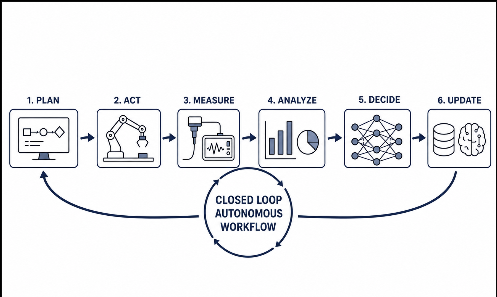
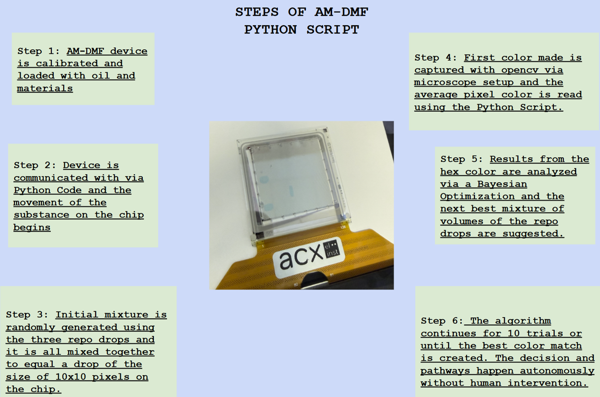

# ACX Chip Project

##  Integration of a Closed-Loop Autonomous Workflow on an AM-DMF Device
### Kailey McGady’s Summer SULI Project at Argonne National Laboratory

Digital-microfluidics control software for an ACX 128×128 electrowetting chip:
splitting one droplet into equal pieces, and assessing electrode health across
the array.

This README has two parts. **Part I** is the research project — its goals,
method, results and acknowledgements. **Part II** is the software reference for
the code in this repository.

---

# Part I — The research project

### Overview:
Traditional experimentation can be time-consuming, resource-intensive, and subject to human error, making large experimental search spaces difficult to explore efficiently. This project investigated the use of autonomous experimentation and digital microfluidics to reduce experimentation time, improve consistency, and lower the material and energy costs of scientific research. An automated digital microfluidic (AM-DMF) device from ACX Instruments was used to move dyed water droplets and recreate the color-mixing experiment developed in Argonne National Laboratory's Rapid Prototyping Laboratory (RPL). A Python program used a camera to measure the resulting color after each experiment and applied Bayesian optimization to determine the next color mixture. The autonomous workflow successfully demonstrated closed-loop decision making and established a foundation for applying digital microfluidics, robotics, and machine learning to more complex microscale experiments.

## Example Diagram of a Closed-Loop Autonomous Work Flow


## Diagram of the system and its interaction with the code:

 

## Breakdown of the software at work: 
ACX DLL Interface --> Python Controller --> AM-DMF Chip --> Camera --> OpenCV --> Average RGB --> Bayesian Optimization --> Next Experiment

## Project Objectives:
- Develop a closed-loop autonomous experimentation workflow.
- Interface Python with an ACX AM-DMF device.
- Detect droplet color using OpenCV.
- Apply Bayesian Optimization to select future experiments.
- Demonstrate autonomous decision-making with minimal human intervention.

## Future work:
•	Integration into a larger autonomous system via MADSci
•	Experimentation using the current OT-2 experiment designs running at the lab
•	Additional machine learning and AI integrated into the software
•	Integration of the chip into a larger system to function as a diagnostic tool 

---

# Part II — The software

## Overview

The chip is driven through a vendor DLL (`DLLTest.dll`) that exposes seven
functions and **no per-electrode readback of any kind**. Nothing in this
codebase can ask the chip what it actually did. That single fact shapes most of
the design:

- Split runs are **operator-gated**. A human at the microscope answering y/n is
  the only evidence that anything actuated.
- Every claim carries what it did *not* verify. Run reports print an explicit
  `NOT VERIFIED THIS RUN` section.
- Anything running off proven values is stamped as such in the report, so a
  transcript cannot later be mistaken for a verified result.

| Package | Purpose |
|---|---|
| [`microdrop/`](microdrop/README.md) | Symmetric droplet splitting — plan a 2ⁿ-piece tree and drive it with operator gates |
| [`chiphealth/`](chiphealth/README.md) | Chip-health sweep — actuation layer, clearance gate, camera detection, run recording |
| [`basics/`](basics/README.md) | Original vendor-style scripts, kept as the provenance record |
| `colormixing/` | Colour-mixing and dispensing scripts, including `csvvolcont.py` — the proven source for split timing |
| `tests/` | 520 tests, standard library only |
| [`docs/`](docs/README.md) | Guides and the specification record |

## Installation and setup

**Windows is required to touch hardware.** The vendor DLL is Windows x64 and
will not load under WSL or Linux. Everything except the hardware layer —
planning, clearance, the whole test suite — runs anywhere.

```bash
python -m venv .venv
.\.venv\Scripts\pip install opencv-python numpy    # chiphealth only; microdrop needs neither
```

Verify without hardware:

```bash
.\.venv\Scripts\python.exe -m unittest discover -s tests
.\.venv\Scripts\python.exe -m microdrop.protocol --plan-only
```

`--plan-only` opens no USB handle, asks nothing and energises nothing. If it
prints a plan and `CLEARANCE OK`, the install is good.

> **pytest is deliberately not installed.** The suite runs on the standard
> library via `unittest`. See [CONTRIBUTING.md](CONTRIBUTING.md).

## Usage

### Split a droplet

Two fixed-configuration runners, each a reproducible record of one geometry:

```bash
.\.venv\Scripts\python.exe microdrop\run_8piece_split.py    # 8 pieces of 10x5
.\.venv\Scripts\python.exe microdrop\run_16piece_split.py   # 16 pieces of 5x5
```

> ⚠ **Both are always armed.** There is no dry run. Running either one
> energises the chip, and the rails come up before the first gate is asked.
> Neither geometry is currently confirmed on hardware.

For anything you want to vary, use the general-purpose driver:

```bash
# hardware-free: print the plan, the clearance verdict, the volume claim
python -m microdrop.protocol --plan-only --axes WHWH

# live, with a widened stage 2 and a longer dwell on stage 3
python -m microdrop.protocol --arm --axes WHWH \
    --stretch-stage 2:2.2 --settle-stage 3:0.5
```

Full flag table and the operator runbook:
[Running the split scripts](docs/guides/running-the-split-scripts.md).

### Assess chip health

```bash
.\.venv\Scripts\python.exe -m chiphealth.run_health \
    --chip-id trial01 --arm --camera 0 --frame-size 1920x1080 --step-delay 0.5
```

Writes video, stills and a scored summary to `runs/<timestamp>/`. Re-score an
existing run offline with `python rescore.py`.

## Configuration

### Vendor DLL

Set in `chiphealth/config.py`:

| Setting | Default |
|---|---|
| `DEFAULT_DLL_DIR` | `C:\Users\<user>\Downloads\ACX_pythonSDK v1.2 3\ACX_pythonSDK\windows` |
| `DEFAULT_DLL_NAME` | `DLLTest.dll` |

Override per run with `--dll-dir`. The loader refuses a DLL missing any of the
seven exports it calls rather than failing later at an arbitrary call site.

### Chip constants

`chiphealth/config.py::ChipConfig`. Every value was a magic number repeated
across the legacy scripts before it was centralised here.

| Setting | Value | Source |
|---|---|---|
| `rows` × `cols` | 128 × 128 | Array size |
| `pitch_um` | 246.48 | Measured 2026-08-10 |
| `volts` | 45, 45, 45, then 0×6 | `csvvolcont.py:162-165` |
| `volt_tolerance` | ±2 V | `csvvolcont.py:182-183` |
| `volt_settle_s` | 0.3 | `csvvolcont.py:168` |
| `gap_um` | `None` | **Unmeasured** — blocks any absolute volume figure |

Split parameters live separately in `microdrop/params.py`, each marked PROVEN
or DERIVED. See [Provenance](docs/guides/provenance.md).

### Machine-local files

`calibration.json` (camera corners) and `runs/` (experiment artifacts) are
gitignored. The run artifacts are the experimental record — back them up
elsewhere, just not here.

## Contributing

See [CONTRIBUTING.md](CONTRIBUTING.md) for how to run the tests, the
`check_geometry()` safety pattern, and commit conventions.

Two rules worth stating up front:

1. **A green test suite is not hardware verification.** Never label a geometry
   "verified" on the strength of passing tests. Only a live run that an
   operator confirmed does that.
2. **Never remove a documented failure mode from a comment** because the code
   looks obvious without it. Several comments in this repo exist because the
   obvious-looking version was wrong on hardware.

## Documentation

[docs/README.md](docs/README.md) is the index — task-focused guides, plus the
specification and design record in `docs/spec/`.

---

## Acknowledgements:
This research was conducted through the U.S. Department of Energy Science Undergraduate Laboratory Internships (SULI) program at Argonne National Laboratory.

I would like to express my sincere gratitude to Casey Stone for her mentorship, technical guidance, and encouragement throughout this project. Her support greatly expanded my understanding of autonomous experimentation, digital microfluidics, computer vision, and scientific software development.
I’d also like to thank ACX Instruments for providing the Automated Digital Microfluidic (AM-DMF) platform used in this work. The AM-DMF device was designed and created by them. For more info on the company and their device you can find them here; https://www.acxinst.com/

Finally, I am grateful to the U.S. Department of Energy Office of Science for supporting my undergraduate research. This project reflects the collaborative efforts of many researchers who generously shared their knowledge and expertise, and I am thankful to have contributed to the development of autonomous laboratory technologies. This experience has strengthened my passion for research, and I look forward to continuing to work in this field.  
